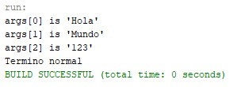
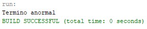

# Java Exception Handling

A Java console application that demonstrates basic exception handling through the use of `try`, `catch`, and `finally`.

The program processes command-line arguments when they are provided and detects the absence of arguments as an exceptional condition. Regardless of the execution result, the application reports whether the program terminated normally or abnormally.

## Features

- Processes command-line arguments dynamically.
- Validates whether arguments were provided before accessing the array.
- Uses `IllegalArgumentException` to represent an invalid execution state.
- Handles exceptions using a `try-catch-finally` structure.
- Reports normal or abnormal program termination.
- Prevents invalid array access when no arguments are provided.

## Concepts Demonstrated

This project demonstrates the following Java concepts:

- Command-line arguments
- Arrays
- Array length validation
- `try`
- `catch`
- `finally`
- `Exception`
- `IllegalArgumentException`
- Boolean control variables
- Exception handling flow

## Project Structure

```text
Java-Exception-Handling/
│
├── src/
│   └── ejercicio1/
│       └── TestExceptions.java
│
├── assets/
│   └── images/
│       ├── normal_execution.jpg
│       └── abnormal_execution.jpg
│
└── README.md
```

## Program Logic

The application uses the following execution flow:

1. A boolean variable named `huboError` is initialized with `false`.
2. The program enters a `try` block.
3. The application verifies whether command-line arguments were provided.
4. If no arguments are present, an `IllegalArgumentException` is thrown.
5. If arguments are available, each element is displayed.
6. If an exception occurs, the `catch` block changes `huboError` to `true`.
7. The `finally` block is always executed.
8. The application reports either normal or abnormal termination.

## Source Code

### `TestExceptions.java`

```java
package ejercicio1;

public class TestExceptions {

    public static void main(String[] args) {
        boolean huboError = false;

        try {
            // Evaluamos si el arreglo está vacío antes de recorrer
            if (args.length == 0) {
                throw new IllegalArgumentException("No se pasaron argumentos.");
            }

            // Bucle controlado por el tamaño del arreglo
            for (int i = 0; i < args.length; i++) {
                System.out.println("args[" + i + "] is '" + args[i] + "'");
            }
        } catch (Exception e) {
            huboError = true;
        } finally {
            if (huboError) {
                System.out.println("Termino anormal");
            } else {
                System.out.println("Termino normal");
            }
        }
    }
}
```

## Execution Cases

### Normal Execution

When one or more command-line arguments are provided, the program displays each argument and finishes normally.

Example:

```text
args[0] is 'Java'
args[1] is 'Exceptions'
Termino normal
```

The following screenshot shows the application running successfully with command-line arguments:



### Abnormal Execution

When the application is executed without command-line arguments, the program throws an `IllegalArgumentException`.

The exception is caught by the `catch` block, the `huboError` variable is updated, and the `finally` block reports abnormal termination.

Expected output:

```text
Termino anormal
```

The following screenshot shows the application running without command-line arguments:



## Exception Handling Flow

```text
                Program Starts
                       │
                       ▼
              Enter try block
                       │
                       ▼
          Are arguments available?
                 │           │
                Yes          No
                 │           │
                 ▼           ▼
        Display arguments   Throw exception
                 │           │
                 │           ▼
                 │       Enter catch
                 │           │
                 ▼           ▼
              finally is always executed
                       │
                       ▼
            Normal or abnormal termination
                       │
                       ▼
                  Program Ends
```

## Requirements

- Java Development Kit (JDK) 8 or later
- Java IDE such as NetBeans, IntelliJ IDEA, or Eclipse

## How to Run

### From an IDE

1. Open the project in your preferred Java IDE.
2. Locate the `TestExceptions` class.
3. Configure command-line arguments if you want to test the normal execution path.
4. Run the application.

To test abnormal execution, run the application without command-line arguments.

### From the Command Line

Compile the program:

```bash
javac ejercicio1/TestExceptions.java
```

Run without arguments:

```bash
java ejercicio1.TestExceptions
```

Run with arguments:

```bash
java ejercicio1.TestExceptions Java Exceptions
```

## Expected Behavior

| Execution | Result |
|---|---|
| Arguments are provided | Each argument is displayed and the program reports normal termination |
| No arguments are provided | An exception is handled and the program reports abnormal termination |

## Notes

The `finally` block is executed regardless of whether an exception occurs. In this implementation, it is responsible for reporting the final execution state of the application.

The boolean variable `huboError` allows the program to preserve the result of the exception-handling process and determine which final message should be displayed.

The program intentionally validates the length of the `args` array before processing it, preventing an invalid execution flow when no command-line arguments are available.

## Repository Purpose

This repository was created as a Java programming exercise focused on understanding the basic flow of exception handling and the use of command-line arguments.

The project provides a simple example of how `try`, `catch`, and `finally` can work together to control program execution and report its final state.

## Author

Luis Alva
